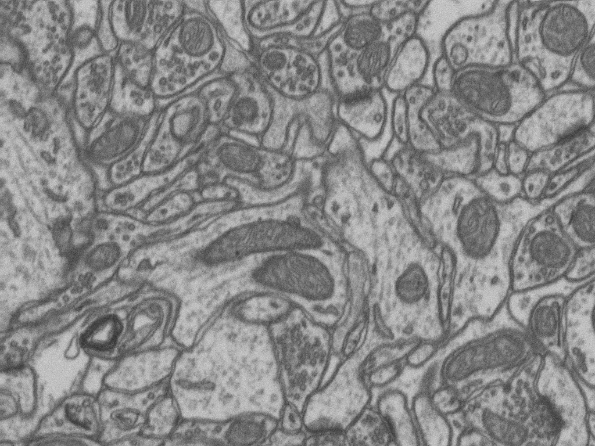
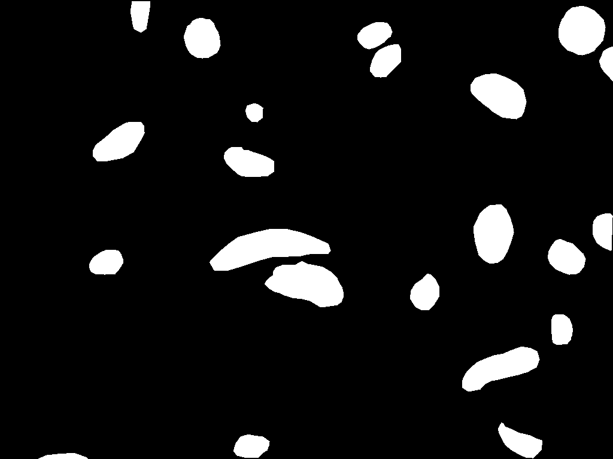
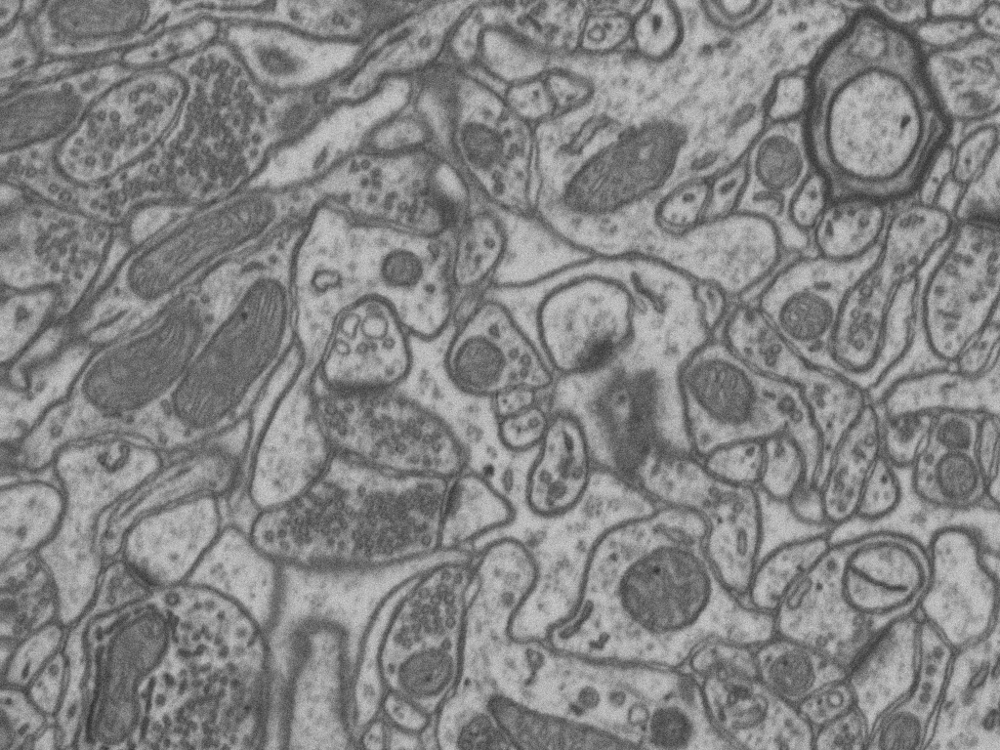
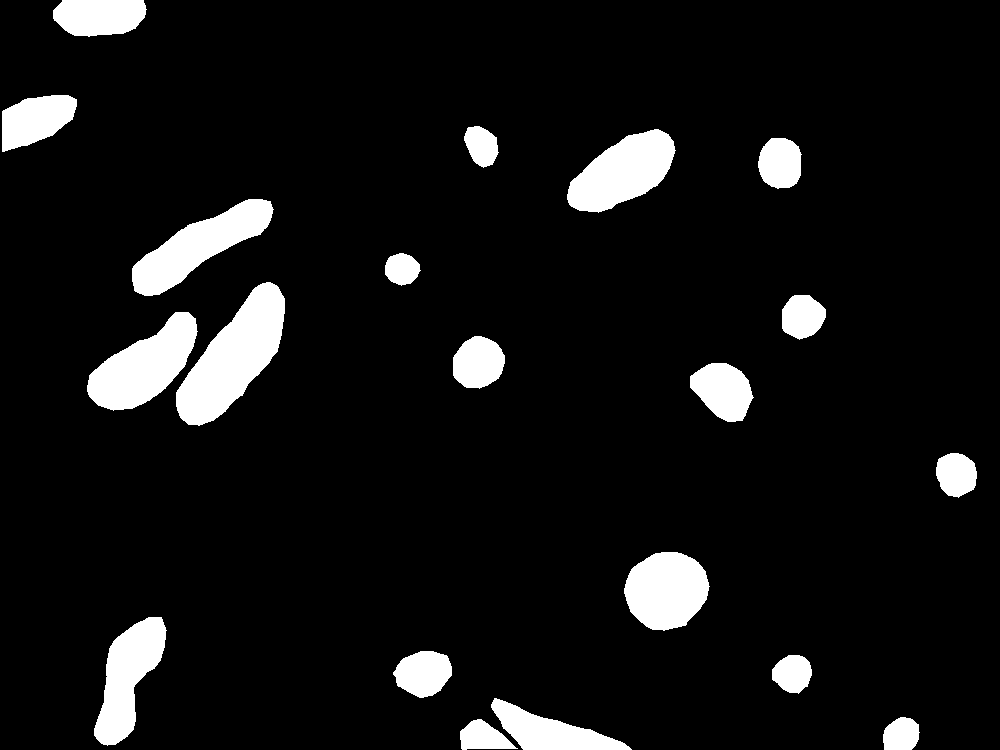
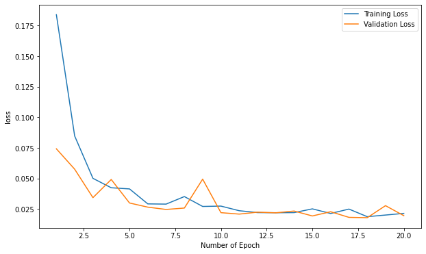
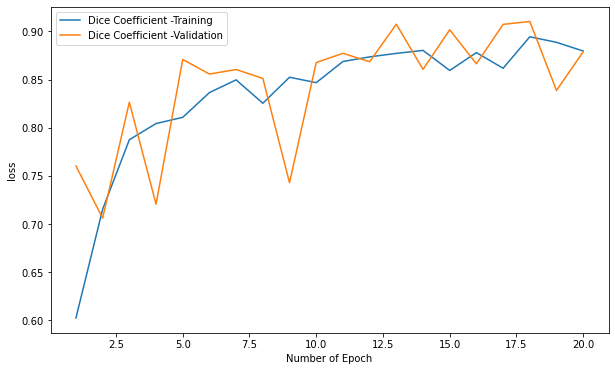
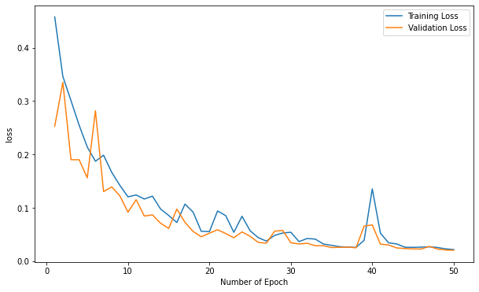
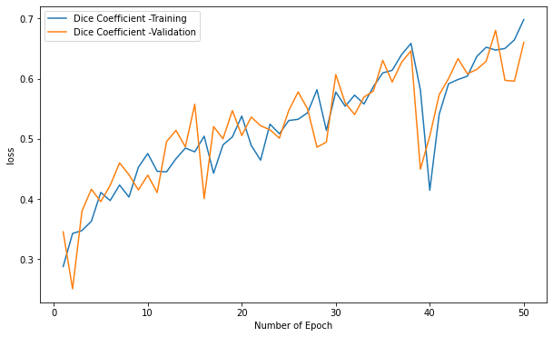

# Automatic Mitochondria Segmentation on Electron Microscopic Data

Studies have shown that there exists a relation between mitochondrial functions and degenerative disorders related to ageing, such as Alzheimer's and Parkinson's diseases. Hence, there is a dire need for detailed and high-resolution analysis of physical alterations in mitochondria. Currently, the process is manual and laborious. Using U-Net based architectures, we have performed pixel based classification (semantic segmentation) to automatically segment mitochondria in the cells.

## Table of Contents

- [Data](#data)
- [Model](#model)
  - [2D U-Net](#2dunet)
    - [Architecture](#2darch)
    - [Training & Evaluation](#2dtrain)
  - [3D U-Net](#3dunet)
    - [Architecture](#3darch)
    - [Training & Evaluation](#3dtrain)
- [Results](#results)
- [Dependencies](#libraries)
- [References](#references)

## Data 

We have used annotated [dataset](https://www.epfl.ch/labs/cvlab/data/data-em/) from EPFL University, Switzerland. The 3D image represents a 5x5x5µm section taken from the CA1 hippocampus region of the brain, corresponding to a 1065x2048x1536 volume.

  
  

  
  

## Model 

[U-Net](https://arxiv.org/abs/1505.04597) is an U-shaped encoder-decoder convolution network architecture popularly used for semantic segmentation. It was developed by Olaf Ronneberger, Philipp Fischer and Thomas Brox. We have trained both 2D and 3D unet architectures on the dataset and compared their performance. To evaluate these models, we have used dice coefficient metric.

## 2D U-Net 

`unet.py` contains the implementation of 2D U-Net. 

### Architecture 

  

 

Blue box represents multi-channel feature map. The number of channels is mentioned on the top of each feature map.

### Training & Evaluation

The `2DUNet-mitochondria-segmentation-walkthrough.ipynb` contains the data preparation, training and evaluation of the 2D U-Net architecture. For training, we have croppped the subvolume to generate 256x256 2D slices. The model achieves a dice coefficient score of 0.87 with just 10 epochs.

  
  

## 3D U-Net 

`unet3d.py` contains the implementation of 3D U-Net. 

### Architecture 

  

 

Blue box represents multi-channel feature map. The number of channels is mentioned on the top of each feature map.

### Training & Evaluation

The `3DUNet-mitochondria-segmentation-walkthrough.ipynb` contains the data preparation, training and evaluation of the 3D U-Net architecture. For training, we have croppped the subvolume to generate voxels of size 64x64x64. The model achieves a dice coefficient score of 0.66 with ~50 epochs.

  
  

  
## Results 

The 2D U-Net architecture performs better than 3D U-Net architecture with very less computation. However, it is possible that with large size voxels, 3D U-Net architecture might outperform the 2D U-Net architecture. 

## Dependencies

The codes and notebooks depend on the following libraries:

* Pytorch 1.10.0
* Patchify 

This code is compatible with Python versions >=3.8.

## References
* [U-Net: Convolutional Networks for Biomedical Image Segmentation](https://arxiv.org/abs/1505.04597).
* [3D U-Net: Learning Dense Volumetric Segmentation from Sparse Annotation](https://arxiv.org/abs/1606.06650).
* [How to Improve Class Imbalance using Class Weights in Machine Learning](https://www.analyticsvidhya.com/blog/2020/10/improve-class-imbalance-class-weights/)
* [2D U-Net Architecture](https://lmb.informatik.uni-freiburg.de/people/ronneber/u-net/)
* [3D U-Net Architecture](https://www.researchgate.net/figure/The-3D-u-net-architecture-Blue-boxes-represent-feature-maps-The-number-of-channels-is_fig1_304226155)
